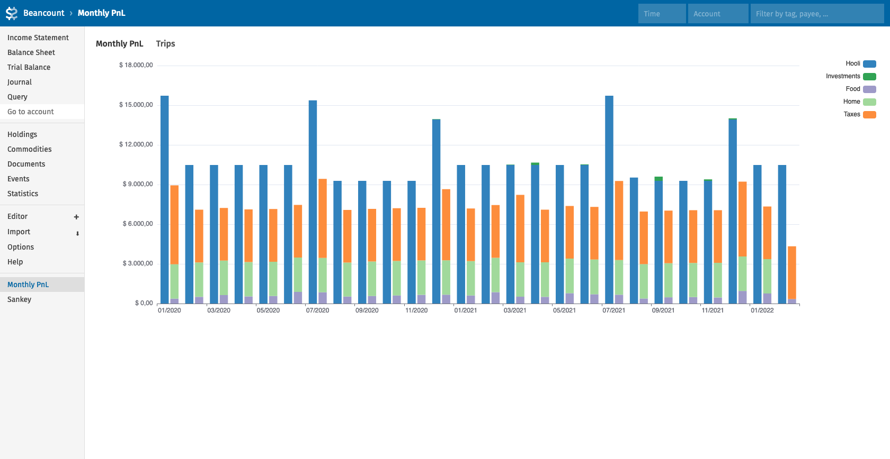
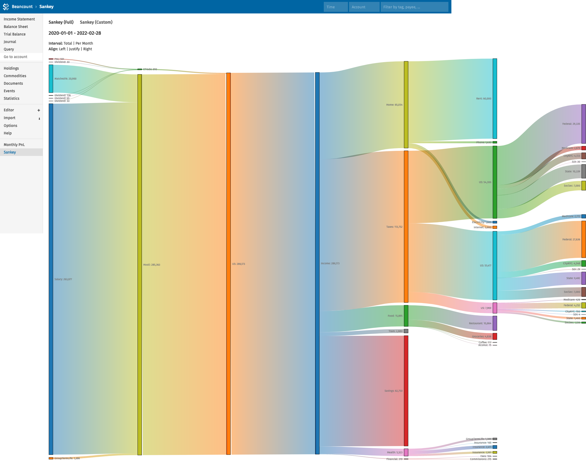

# Fava Income Reports
fava-income-reports adds new charts to [Fava](https://github.com/beancount/fava):
* a monthly profit and loss bar chart
* a sankey chart with all income and expense accounts, and their hierarchy

All charts support filtering using the Fava filter options (by time, account, tags and other metadata).

[](example/monthly_pnl.png)
[](example/sankey.png)

## Installation
```
pip install git+https://github.com/andreasgerstmayr/fava-income-reports.git
```

Enable this plugin in Fava by adding the following lines to your ledger:
```
2010-01-01 custom "fava-extension" "fava_income_reports"
```

## Configuration
Please take a look at the example [monthly_pnl.yaml](example/monthly_pnl.yaml) and [sankey.yaml](example/sankey.yaml) example configuration files.

The sankey chart supports two modes: a *full* mode showing all income and expense accounts, and a *custom* mode showing data from beancount queries (BQL) defined in the `sankey.yaml` configuration file.

## View Example Ledger
`cd example; fava example.beancount`

## Building from Source
Run `make build` to compile the frontend. The compiled and bundled frontend will be placed in `fava_income_reports/templates`.

You can run `make watch` to automatically rebuild the frontend for any changes.

## Related Projects
* [Fava Portfolio Returns](https://github.com/andreasgerstmayr/fava-portfolio-returns)

## Acknowledgements
Thanks to Martin Blais and all contributors of [beancount](https://github.com/beancount/beancount),
Jakob Schnitzer, Dominik Aumayr and all contributors of [Fava](https://github.com/beancount/fava),
and to all contributors of [Apache ECharts](https://echarts.apache.org).
